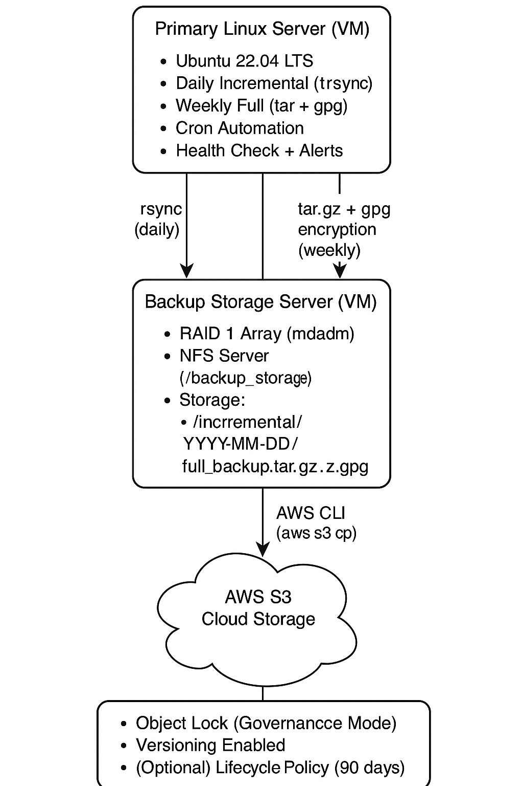

# Enterprise-Grade Linux Backup and Disaster Recovery System

## Overview

This project implements a **complete enterprise-grade backup and disaster recovery system** for Linux servers, featuring:

- **Primary Server** (Ubuntu 22.04 LTS)
- **Backup Storage Server** with **RAID 1** redundancy
- **Daily Incremental Backups** with `rsync`
- **Weekly Full Backups** encrypted with **GPG AES-256**
- **AWS S3 Cloud Sync** with **Object Lock** and **Versioning** for ransomware protection
- **Backup Health Monitoring** with Email Alerts
- **Automated Backup Retention and Cleanup**
- **Disaster Recovery Playbook** for fast system restoration

This setup is designed to provide:
- High availability
- Data integrity
- Ransomware resilience
- Automated backup management

---

## Project Structure

```
backup.sh                 # Daily Incremental Backup Script
full_backup.sh            # Weekly Full Encrypted Backup Script
aws_sync.sh               # AWS S3 Sync Script
check_backup.sh           # Backup Health Check Script
cleanup.sh                # Old Backup Cleanup Script
disaster_recovery_playbook.md  # Disaster Recovery Procedures
architecture_diagram.png   # System Architecture Diagram
README.md
```

---

## Key Features

- **Daily Incremental Backups**  
  Backup of `/home`, `/etc`, and `/var/www` with `rsync`, syncing only changed files.

- **Weekly Full Encrypted Backups**  
  Full compressed backups encrypted using GPG AES-256 for security.

- **Local Redundancy**  
  Backup Storage Server configured with **RAID 1** (mirrored disks) for hardware fault tolerance.

- **Remote Offsite Backup**  
  Encrypted full backups synced to an **AWS S3** bucket with **Object Lock** and **Versioning** enabled to protect against ransomware and accidental deletion.

- **Monitoring & Alerts**  
  Automatic daily health checks; email notifications if backups are missing or incomplete.

- **Retention Policy**  
  - Keep incremental backups for 7 days
  - Keep full backups for 4 weeks
  - Automatic cleanup with cron job
  - Optional: S3 Lifecycle Policy to delete old backups after 90 days

- **Disaster Recovery Playbook**  
  Step-by-step recovery instructions for restoring from NFS or AWS S3 backups in case of failure.

---

## System Architecture



---

## Disaster Recovery Playbook

Detailed disaster recovery procedures can be found here:

[Disaster Recovery Playbook](disaster_recovery_playbook.md)

Includes:
- How to mount NFS backups and restore
- How to pull backups from AWS S3 and decrypt
- How to restore using GPG private keys

---

## Security Practices

- Backups are encrypted before uploading to AWS S3.
- GPG private keys are securely stored offline.
- AWS S3 bucket has Object Lock (Governance Mode) enabled to prevent tampering.
- Monitoring with alerts ensures prompt notification of backup issues.

---

## Cron Job Schedule

| Job | Schedule |
|----|----------|
| Daily Incremental Backup | `2:00 AM` every day |
| Weekly Full Backup | `3:00 AM` every Sunday |
| AWS S3 Sync | `3:30 AM` every Sunday |
| Backup Health Check | `4:00 AM` every day |
| Cleanup Old Backups | `5:00 AM` every day |

---

## Author

Created by [bt00000](https://github.com/bt00000)

---

